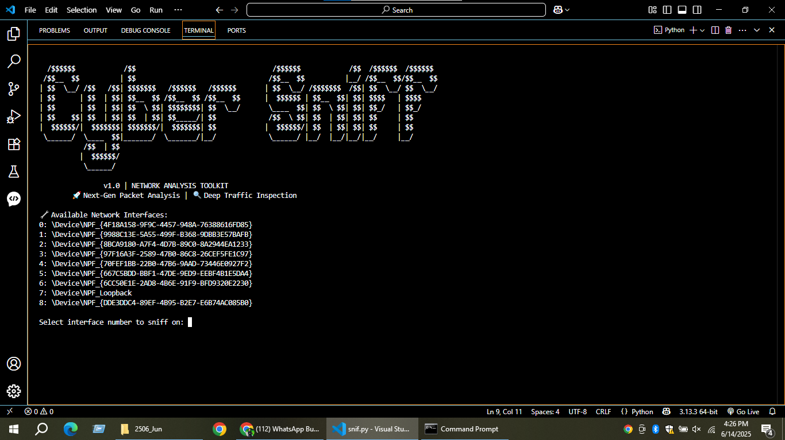

# 🛡️ CyberSniff v1.0

**CyberSniff** is a real-time, cross-platform packet sniffer built in Python using Scapy.  
It analyzes live traffic, detects protocols, and shows detailed packet contents.

## ✨ Features
- Detects TCP, UDP, ICMP and other IP-based packets
- Displays source/destination IP and protocol
- Shows payload (if any) in real-time
- Runs on both Windows and Linux
- ASCII Art Banner on startup

## 📦 Requirements
- Python 3.x
- [Npcap](https://npcap.com/#download) (for Windows)
- Scapy library

Install requirements:
```bash
pip install -r scapy
```
## ▶️ Usage
- Run with admin/root privileges:
```bash
python snif.py
```
---

## 📸 Screenshot




---

---

## 🧠 Author

**Talha Baig**  
[🌐 Website](https://talhabaig.exploreeverything.blog/)  
[🐙 GitHub](https://github.com/talhabaig007)  
[📷 Instagram](https://www.instagram.com/talhabaig007/)  
[🐦 Twitter](https://www.twitter.com/talhabaig007/)  
[📘 Facebook](https://www.facebook.com/p/Talha-Baig-100063795712836/)  
📧 Email: baig78@hackermail.com

## ⚖️ License

This project is licensed under the MIT License - see the [LICENSE](LICENSE) file for details.

---

## ⚠️ Disclaimer

This tool is developed for **educational** and **ethical testing purposes** only. Any misuse of this tool is **not the responsibility** of the developer. Use it only on systems you own or have permission to test.

---
